# BC Fichas

Sistema de emissão de fichas para festas, quermesses e eventos. O operador monta o pedido no balcão tocando nos
produtos, escolhe a forma de pagamento (dinheiro, débito, crédito ou PIX) e as fichas saem na impressora térmica,
uma por item, com corte parcial da guilhotina entre uma e outra.

Feito para rodar leve num **tablet Windows 10 de 32 bits com 1 GB de RAM** (Haier W895A, Atom Z3735G) e imprimir
na **Elgin i9** em papel de 80 mm.

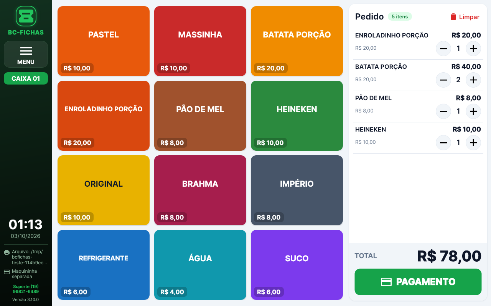

## O que tem

| Tela | O que faz |
| --- | --- |
| **Venda** | Barra lateral estreita, preta e verde: o logo da BC Fichas, o caixa, o **Menu** (verde), as **abas do cardápio** (Comidas, Bebidas…: no máximo 4, em botões grandes, uma embaixo da outra; a escolhida fica branca com uma faixa verde), os botões **Sangria** (laranja) e **Fechar caixa** (vermelho) embaixo, um sobre o outro, e o relógio; o telefone do suporte fica no Menu e na abertura do caixa; botões com foto do produto (ou só cor) que **ocupam a tela toda, sem espaço vazio** (cada aba tem a sua grade, veja "Grade de botões"); pedido com + e − (o valor de cada linha fica sempre à vista, mesmo com nome comprido); **tocar em cima de um item do pedido tira 1**, igual ao − (com 1, o item sai do pedido): um alvo grande, que ajuda quem tem dificuldade de acertar o − pequeno; total e botão de pagamento. Depois de uma venda em dinheiro com troco, o **troco** fica uns 5 segundos em cima do pedido (sem tapar os produtos). |
| **Pagamento** | Cartões grandes para Dinheiro, PIX (com o símbolo oficial do Pix), Débito e Crédito. Dinheiro: o valor recebido **já vem com o valor da venda** (pagou certinho, é só confirmar); se o cliente deu mais, é só digitar (a primeira tecla apaga e começa do zero) ou tocar nas notas, e o troco (ou quanto falta) aparece embaixo; o **Limpar** fica no teclado, no lugar do 00. Débito, crédito e PIX registrados para o relatório (veja "Maquininha de cartão"). |
| **Menu** | Produtos, Relatórios, Configurações e Sair (Sangria e Fechar caixa ficam na barra lateral). **Reimprimir** e **Devolver fichas** só aparecem quando a BC Fichas libera para o cliente (Configurações → Máquina). Ao voltar de uma tela aberta pelo menu, o menu continua aberto; ele só fecha no X. |
| **Produtos** | Nome, detalhe, preço, custo, aba, posição na tela, cor, imagem (o botão Imagem abre sempre em `C:\Sistema_New\produtos`), estoque, fichas por unidade e **combos** (veja "Combos"). Produto pode ficar fora da tela de venda. |
| **Reimprimir fichas** | Segunda via do pedido inteiro ou de um item só (sai marcado "REIMPRESSÃO"); fichas devolvidas não são reimpressas. Sem a reimpressão liberada, um pedido pago cujas fichas não saíram (impressora falhou) aparece em **Menu → Fichas não impressas** e sai uma vez. |
| **Devolver fichas** | Só em dinheiro: digita o valor das fichas que o cliente devolveu e ele sai do caixa como uma sangria, no total de devoluções. Veja "Devolução de fichas". |
| **Sangria / Suprimento** | Na barra lateral da venda. Tira ou põe dinheiro no caixa, com comprovante impresso; mostra em destaque quanto deve haver na gaveta e quanto fica depois. |
| **Relatórios** | Caixa atual, caixas anteriores e sangrias: totais por forma de pagamento, fichas devolvidas, venda líquida e produtos vendidos. |
| **Abrir / Fechar caixa** | Só o troco inicial, digitado ou somado com os **valores rápidos** (+R$ 1, 5, 10, 20, 50, 100); cada caixa é identificado pelo número (Caixa 01, 02…) e imprime o comprovante de **abertura de caixa** (troco, data e hora); no fechamento confere o dinheiro da gaveta (falta/sobra), imprime o relatório e, se configurado, desliga o tablet na hora. |
| **Configurações** | Tudo em blocos com ícone e explicação. Enquanto houver mudança não salva aparece embaixo a barra **Alterações não salvas** com o botão Salvar (o único da tela), e ao tocar em Voltar o programa pergunta se quer salvar. Nome do evento, rodapé (opcional; embaixo dele toda ficha traz o telefone da BC Fichas), número do caixa (− e +, ou toque no número para digitar), modelo da ficha (7 modelos com prévia), borda, fonte, logotipo, código de barras, grade de botões, pasta das fotos, impressora (com ajuste da posição no papel), corte da guilhotina, maquininha, senha master e telas travadas. |
| **Máquina** | Só com a **senha técnica** da BC Fichas (pedida toda vez que se entra na aba; no modo teste não pede). Libera Devolução e Reimpressão no menu para o cliente que pedir; backup da programação (pasta padrão e pendrive) e restaurar em outra máquina escolhendo o número do caixa; deixa a máquina pura para o cliente ou zera a programação para um novo evento. Veja "Programar várias máquinas". |

Também tem teclado na tela (para tablet sem teclado físico), ajuste de tamanho da tela e modo tela cheia.

| Abertura do caixa | Formas de pagamento | Pagamento no cartão / PIX |
| --- | --- | --- |
| 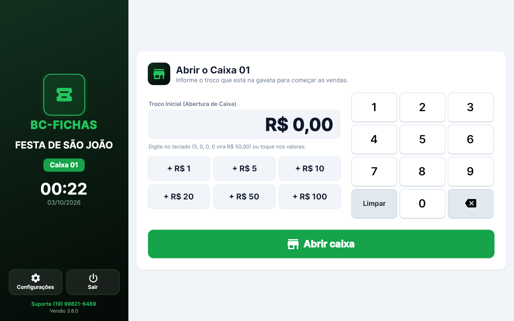 | 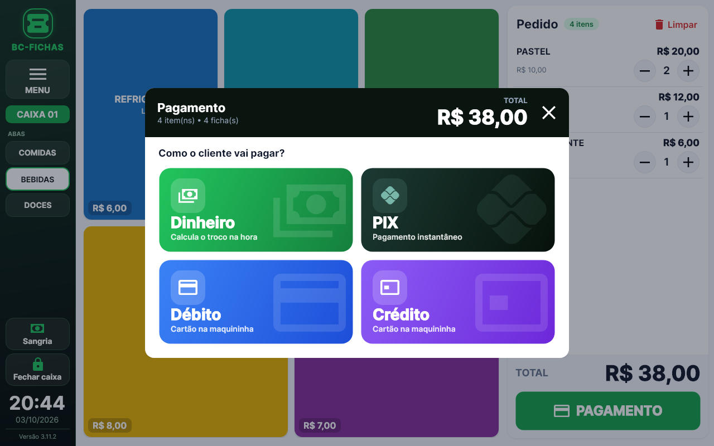 | 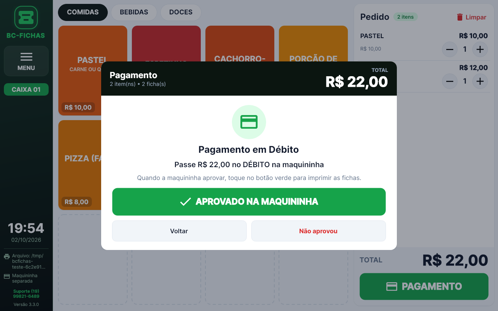 |

| Troco depois da venda | Dinheiro já com o valor da venda | Devolução de fichas |
| --- | --- | --- |
| 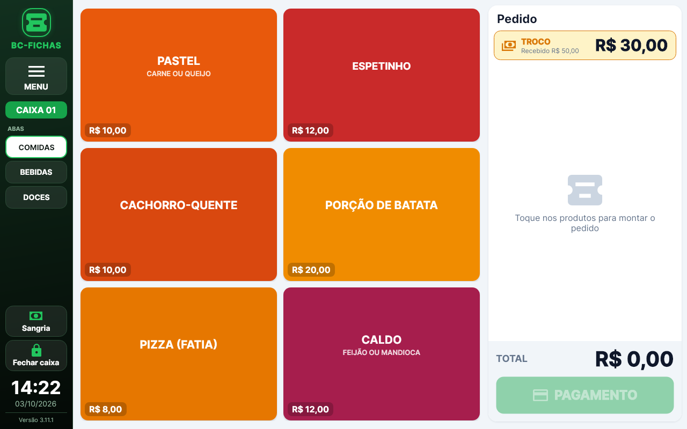 |  | 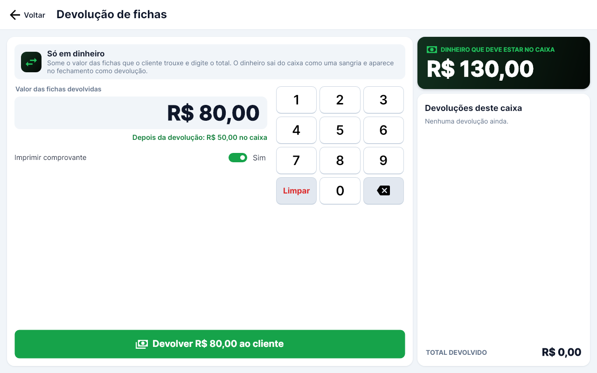 |

| Sangria | Segurança | Modo teste |
| --- | --- | --- |
| 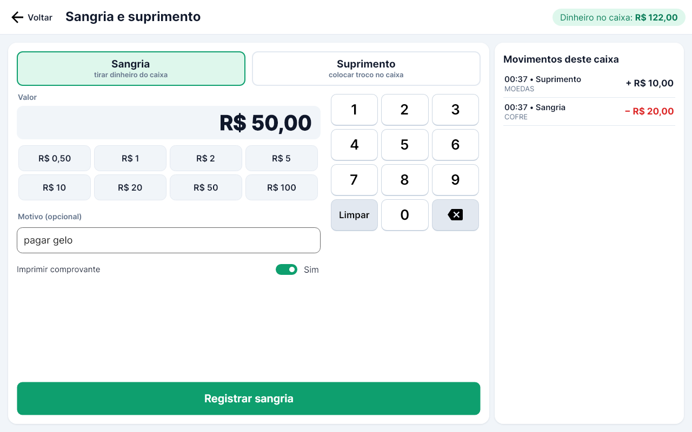 | 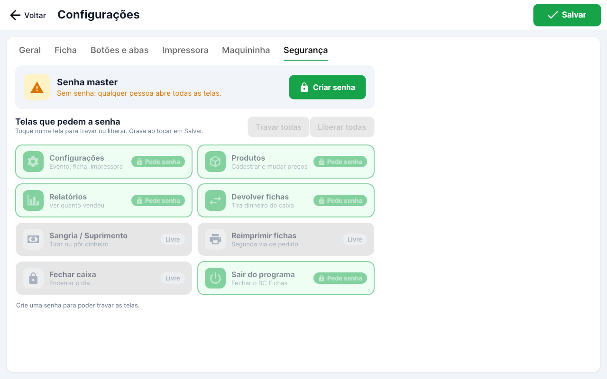 | 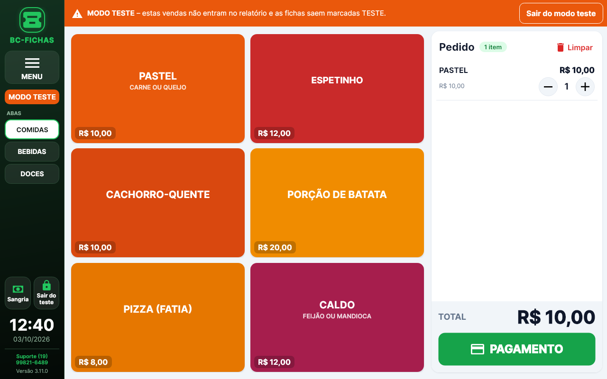 |

| Configurações: Geral | Ficha | Impressora |
| --- | --- | --- |
| 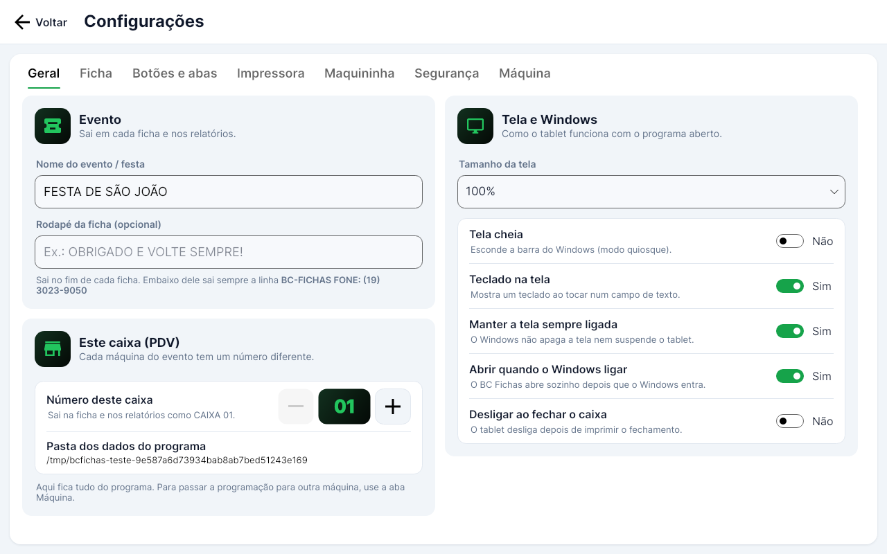 |  | 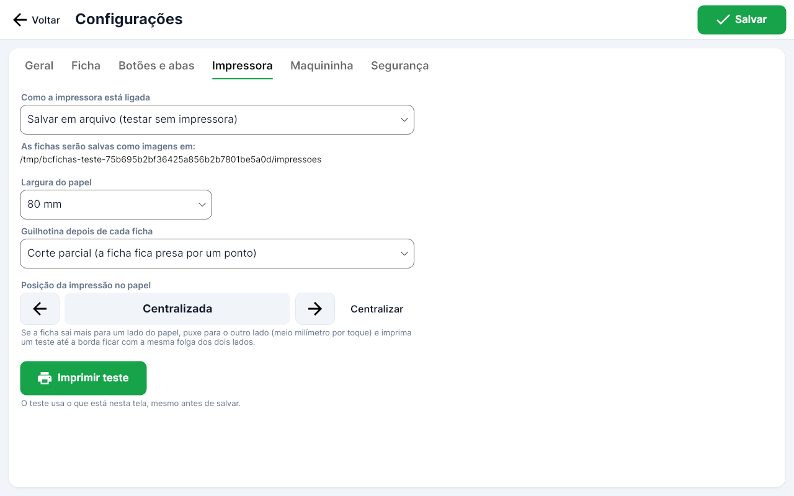 |

### Modelos de ficha (papel de 80 mm)

Modelos 1 a 4: os mesmos do sistema antigo, redesenhados.


Modelos 5 a 7: novos.


Depois de cada ficha a guilhotina faz **corte parcial** (a ficha fica presa por um ponto e o operador destaca).
Em Configurações → Impressora dá para trocar para corte total ou sem corte.

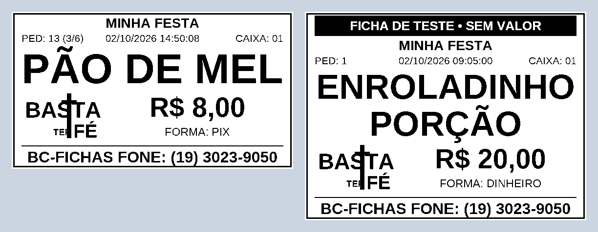

O produto sai o maior possível ocupando a largura da ficha, e a linha `BC-FICHAS FONE: (19) 3023-9050` sai grande,
de lado a lado, no fim de toda ficha. Se a ficha sair mais para um lado do papel, ajuste em
**Configurações → Impressora → Posição da impressão no papel** (meio milímetro por toque) e imprima um teste: a
borda do teste tem de ficar com a mesma folga dos dois lados. O espaço em branco antes da primeira linha é a
distância entre a cabeça de impressão e a guilhotina (é da impressora; toda ficha cortada tem).

Comprovantes de abertura de caixa, devolução de fichas e teste de impressão:

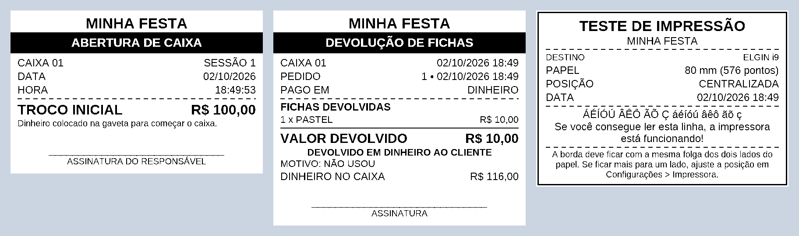

Mais telas em [`docs/telas`](docs/telas).

## Grade de botões

Cada aba da tela de venda tem a sua grade (**Configurações → Botões e abas → toque na grade da aba**), com a
prévia dos produtos dela:

- **Automática (recomendado):** o programa escolhe quantos botões vão em cada linha para eles ficarem do maior
  tamanho possível, com as linhas equilibradas (7 produtos = 4 + 3; 10 = 4 + 3 + 3). Cadastrou ou tirou um
  produto, a tela se ajusta sozinha.
- **Colunas × linhas:** você escolhe (por exemplo 4 × 2 = até 8 botões). Com menos produtos, as linhas que sobram
  somem e os botões crescem; a última linha estica. Os produtos ficam na ordem das posições, sempre no mesmo lugar.

Nos dois jeitos **não sobra espaço vazio**: os botões ocupam a área toda. A arrumação segue o que fazem as
galerias de vídeo-chamada e os sistemas de caixa que deixam a grade por categoria (com "0 = automático").

| Escolher a grade da aba | 4 por linha com 7 produtos |
| --- | --- |
| 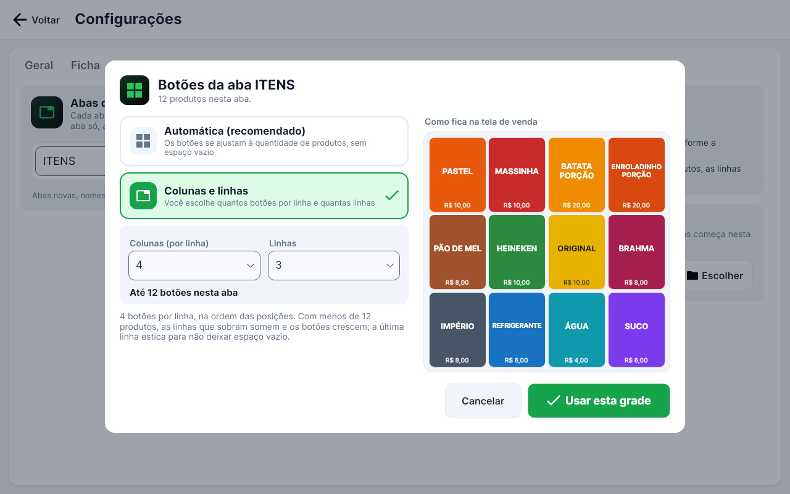 | 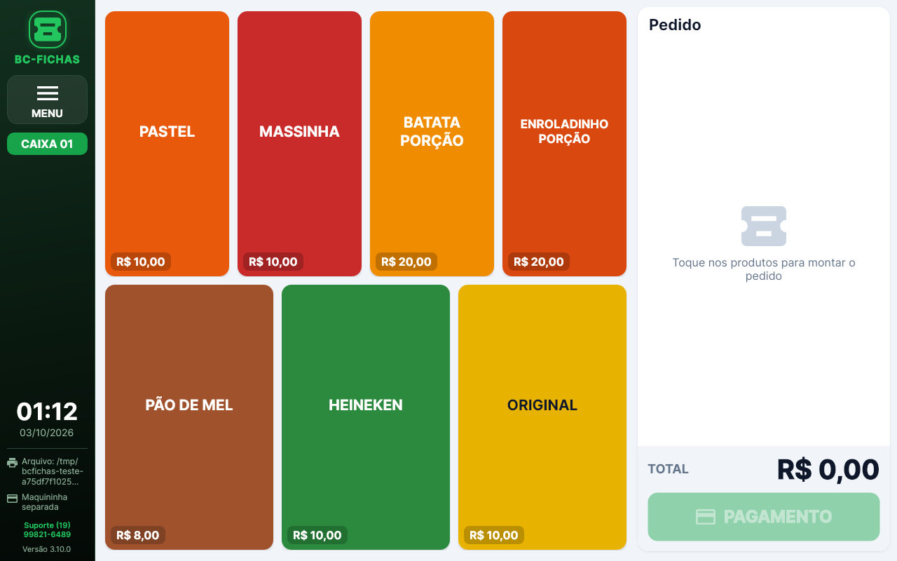 |

## Maquininha de cartão

Por enquanto a maquininha é usada **separada** do programa: no pagamento com débito, crédito ou PIX o programa
mostra o valor para passar na maquininha e, quando ela aprova, o operador toca em **APROVADO NA MAQUININHA** e as
fichas saem. A forma de pagamento fica registrada nos relatórios e no fechamento. Se o programa fechar no meio
de um pagamento, ao abrir de novo ele pergunta se a maquininha aprovou.

Para treinar sem maquininha existe o modo **simulador** (Configurações → Maquininha). O tipo de maquininha é de
cada máquina e não vai no backup da programação: um simulador de treino nunca chega às máquinas do evento. A ligação de verdade
(tablet → Bluetooth/cabo → maquininha) entra como mais uma opção nessa mesma tela: o programa conversa com a
maquininha por uma interface única (`IMaquininha`), então essa etapa não mexe nas outras telas.

## Combos

Combo é um produto vendido por um preço só que imprime várias fichas. No relatório e no fechamento aparece o
combo; nas fichas sai o que você escreveu em cada linha.

Em **Menu → Produtos**, crie o produto (ex.: `COMBO R$ 100,00`), ligue **Combo** e abre a tela **Fichas do
combo**, igual à do sistema antigo, só que mais fácil:

- Escreva o **produto** (o que sai grande na ficha), o **detalhe** (opcional, ex.: `VAL. 05/10/26`), a **quantidade**
  e o **valor de cada** ficha e toque em **Adicionar**. Repetindo a mesma ficha, a quantidade soma. Depois de
  adicionar, o detalhe continua preenchido para a próxima linha.
- **Atalhos** (painel à direita): **um toque já põe a ficha no combo**, usando a Qtde e o Detalhe digitados em
  cima. Vales de R$ 1, 2, 5, 10, 20 e 50 e os produtos cadastrados (esses baixam o estoque do produto). Tocando de
  novo, soma na mesma linha.
- Na lista: **−** tira uma ficha, **+** põe mais uma, a **lixeira** tira todas daquela linha.
- Embaixo aparecem quantas fichas são, o **total das fichas** e se ele confere com o preço do combo; o botão
  **Usar o total como preço do combo** acerta o preço. **Salvar combo** grava.

Exemplos: `COMBO HEINEKEN` por R$ 30,00 com 5 fichas `HEINEKEN` de R$ 6,50 (o relatório mostra o combo de
R$ 30,00); `COMBO R$ 100,00` com 5 × `VALE R$ 10,00`, 6 × `VALE R$ 5,00`, 5 × `VALE R$ 2,00` e 10 × `VALE R$ 1,00`.

Cada ficha do combo vale a sua parte do preço do combo (no COMBO HEINEKEN de R$ 30,00, cada uma das 5 fichas
vale R$ 6,00; nos vales que somam o preço, cada vale o seu valor). A venda guarda o combo
como ele era na hora: mudar o combo depois não muda as fichas já vendidas (nem a reimpressão). A ficha que
sai do combo é igual à do produto vendido sozinho (o nome do combo não sai embaixo); se a ficha do combo tiver
um detalhe (ex.: `VAL. 05/10/26`), ele sai na linha de baixo.

| Fichas do combo | Ficha que saiu do combo |
| --- | --- |
| 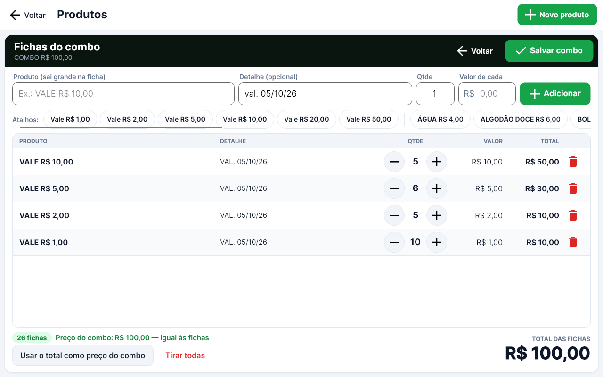 | 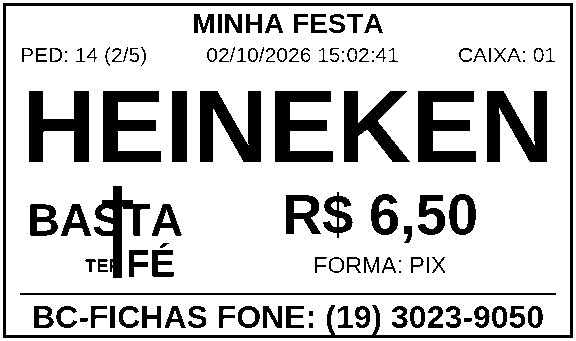 |

## Devolução de fichas

Só aparece no menu quando a BC Fichas libera (**Configurações → Máquina → Liberar no menu**). A devolução é
**só em dinheiro** e não precisa do número da venda. O cliente devolveu fichas que somam R$ 80,00? Em
**Menu → Devolver fichas**:

1. Some o valor das fichas e digite o total (o programa mostra quanto fica no caixa depois).
2. Toque em **Devolver R$ 80,00 ao cliente** e entregue o dinheiro. Sai um comprovante para guardar junto com as
   fichas devolvidas.

O dinheiro sai da gaveta como uma sangria, mas conta à parte, no **total de devoluções**: o fechamento e os
relatórios mostram as devoluções, a venda líquida (vendido − devolvido) e o dinheiro esperado na gaveta já
descontado. Não dá para devolver mais do que há no caixa. Por padrão a devolução pede a senha master.

## Modo teste (para quem programa a máquina)

Para testar a máquina na montagem sem que as vendas apareçam no relatório do cliente: toque **5 vezes seguidas
no logo da BC Fichas** (na barra lateral ou na tela de abrir o caixa) ou aperte **F1** num teclado ligado ao
tablet, e digite a senha master.

- Aparece a faixa laranja **MODO TESTE**; as vendas vão para um caixa separado, com numeração própria (começa do 1).
- As fichas saem marcadas **FICHA DE TESTE • SEM VALOR** e o estoque não é mexido.
- A aba **Máquina** das Configurações abre sem a senha técnica (quem está no modo teste é a BC Fichas).
- Para sair: **Menu → Sair do modo teste** (ou o botão na faixa laranja, ou **Sair do teste** na barra lateral). Tudo o que foi feito no teste é apagado
  e o programa volta ao caixa normal.

## Programar várias máquinas

No sistema antigo era copiar o banco de dados, o logo e as imagens de uma máquina para a outra e mudar o número
do caixa. Aqui é um arquivo só, em **Menu → Configurações → Máquina** (pede a senha técnica da BC Fichas, menos no
modo teste):

1. **Programe uma máquina** (produtos, combos, abas, evento, logotipo, modelo da ficha) e toque em **Fazer
   backup**. Sai o arquivo `BCFichas - NOME DO EVENTO.bcf` na **pasta do backup** (padrão `C:\Sistema_New\backup`,
   dá para mudar na mesma tela) e, se tiver pendrive no tablet, nele também. O arquivo leva produtos, combos,
   imagens, logotipo, evento, ficha e senha, e **nunca leva vendas** (o estoque vai como era antes das vendas
   desta máquina). Se você mudou algo na tela e não salvou, o programa pergunta se salva antes.
2. **Na outra máquina** copie o arquivo para a pasta do backup dela (pelo acesso remoto) ou ponha o pendrive e
   toque em **Restaurar**. O programa acha o arquivo sozinho e mostra a lista (o mais novo em cima, ou
   **Procurar em outro lugar** se o arquivo estiver em outra pasta), mostra o evento e quantos produtos tem e
   pergunta só o **número do caixa (PDV)**. Pronto. Se o arquivo ainda está sendo copiado ou veio de uma versão
   mais nova do programa, ele aparece com o motivo.

Ao restaurar, a máquina fica igual à que foi programada, mas **a impressora, o tamanho da tela, o teclado e as
pastas continuam os dela**. Tudo o que estava guardado nela (vendas, testes, caixas, até um caixa aberto) é
apagado, e o programa avisa antes o que vai sair.

**Deixar pura para o cliente:** depois de testar a máquina, toque em **Apagar as vendas**. Saem vendas, testes,
caixas (até o aberto), sangrias e devoluções, e o pedido e a abertura de caixa (a "SESSÃO" do papel) voltam
para o 1. Os produtos e as configurações ficam.
Se algum produto controla estoque, o programa pergunta: **Devolver ao estoque** (volta ao que era antes das
vendas, para entregar ao cliente) ou **Deixar como está** (outra festa com o que sobrou). Ao fazer o backup numa
máquina que ainda tem vendas, o programa já pergunta se quer apagar — menos com o caixa aberto com vendas, para
ninguém apagar um evento em andamento com um toque.

**Reprogramação para novo evento → Zerar programação:** é o "banco vazio" de antes, para cadastrar um evento
diferente. Apaga vendas, produtos, combos, abas, evento e o jeito da ficha. Ficam só o número do caixa, a impressora, as opções de tela, as pastas e a senha
master; Devolução e Reimpressão voltam a ficar desligadas no menu. As fotos dos produtos, os logotipos e as fichas
salvas pela impressora "Salvar em arquivo" (pasta `dados\impressoes`) também são apagados.

**Fotos e logotipos não acumulam:** ao escolher uma foto ou um logotipo, o programa guarda uma cópia reduzida em
`dados\imagens` com o nome tirado da própria imagem, então a mesma foto escolhida de novo (no mesmo produto ou em
outro) não vira outro arquivo. As imagens que nenhum produto nem o logotipo usam mais (foto trocada, produto
excluído, logotipo antigo, programação de outro evento) são apagadas ao abrir o programa, ao restaurar um backup,
ao apagar as vendas e ao zerar a programação.

| Aba Máquina | Qual backup restaurar | Número do caixa |
| --- | --- | --- |
| 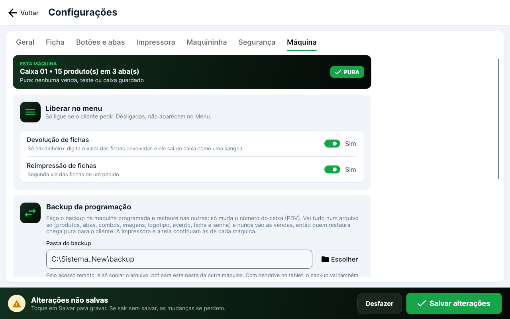 | 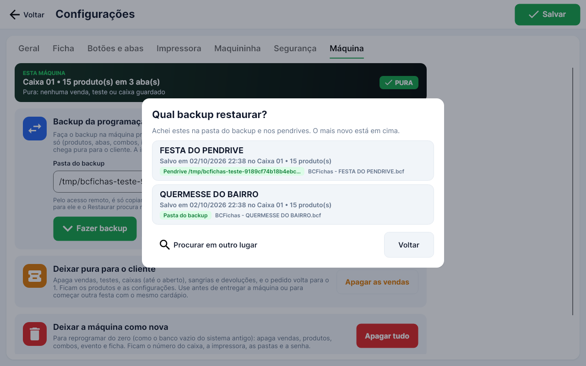 | 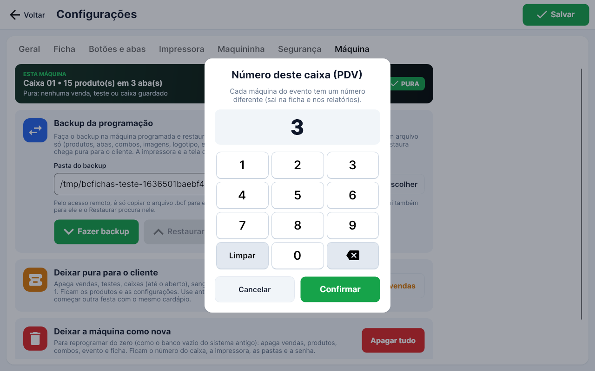 |

Antes de apagar ou restaurar, o programa sempre guarda uma **cópia de segurança** do banco em `dados\backups`
(as 15 últimas; a cópia é só do banco, sem as fotos — para guardar um evento inteiro, use o **Fazer backup**). Para voltar uma cópia: feche o BC Fichas, copie o arquivo `.db` da cópia para
`dados\bcfichas.db` (substituindo) e abra de novo.

## Instalar no tablet

1. Baixe o pacote `BCFichas-win-x86` (tablets de 1–2 GB normalmente usam Windows 32 bits; se o seu for 64 bits,
   use `BCFichas-win-x64`). O pacote é gerado automaticamente pelo GitHub em **Actions → Build → Artifacts**.
2. Descompacte numa pasta, por exemplo `C:\BCFichas`, e abra o `BCFichas.exe`. Não precisa instalar o .NET.
3. Pronto: a partir daí o BC Fichas **abre sozinho quando o Windows liga** e, enquanto está aberto, **a tela não
   apaga e o tablet não suspende** (as duas opções ficam em Configurações → Geral e já vêm ligadas). Se antes
   você tinha posto um atalho em `shell:startup`, pode apagar (não tem problema deixar: o programa não abre duas
   vezes).

Dicas para o tablet ficar como um "caixa" de verdade:

- Para o programa abrir sem ninguém tocar, o Windows precisa entrar sozinho: aperte Windows + R, digite
  `netplwiz`, desmarque "Os usuários devem digitar um nome de usuário e uma senha" e confirme a senha.
- Deixe o tablet na tomada: com a bateria muito fraca o Windows ainda desliga para se proteger, e o botão de
  ligar continua funcionando normalmente.

Na primeira vez o sistema já vem com os produtos do cardápio padrão (pastel, massinha, porções, cervejas…),
sem fotos. Para pôr a foto de um produto: **Menu → Produtos → escolha o produto → Imagem**. O seletor abre sempre
na pasta `C:\Sistema_New\produtos` (dá para mudar em Configurações → Botões e abas); se ela não existir, o
programa avisa e deixa escolher a imagem em outro lugar.

Para pôr o logo oficial da BC Fichas na barra lateral, salve-o como `marca.png` na pasta do programa (ao lado do
`BCFichas.exe`); sem ele aparece o símbolo verde da ficha.

### Tablet com Windows 10 antigo (versão 1511)

O programa usa o .NET 10, que oficialmente pede Windows 10 1607 ou mais novo, mas também roda no Windows Server
2012 — então deve rodar no 1511, que é mais novo que ele. Se não abrir, atualize o Windows ou veja o arquivo
`dados\erros.log`. Dicas para 1 GB de RAM: deixe só o BC Fichas aberto e desligue programas que iniciam com o
Windows.

### Impressora Elgin i9

1. Instale o driver da Elgin i9 no Windows (site da Elgin).
2. No BC Fichas: **Menu → Configurações → Impressora**, escolha "Impressora instalada no Windows", selecione a i9
   e toque em **Imprimir teste**. A lista de impressoras se atualiza sozinha cada vez que você abre essa aba.
3. Se a i9 aparecer só como porta COM no Gerenciador de Dispositivos, escolha "Porta COM" e a porta certa.

As fichas são desenhadas como imagem e mandadas em ESC/POS, então a fonte, os acentos, o logotipo e o código de
barras saem iguais à prévia da tela.

### Backup

Tudo fica na pasta `dados` ao lado do programa (`bcfichas.db` e as imagens). Para fazer backup, copie essa pasta.
Antes de restaurar um backup ou apagar as vendas, o programa guarda sozinho uma cópia em `dados\backups`
(veja "Programar várias máquinas"). Erros ficam registrados em `dados\erros.log`.

### Memória com muitas vendas

As telas leem do banco só o que mostram, então a memória não cresce com o número de vendas. Medido com o
programa aberto na tela de venda: banco vazio ≈ 43 MB de memória própria; banco com **302 mil pedidos** (300
dias de festa com 1000 pedidos, 56 MB de arquivo) ≈ 48 MB. Com 100 mil pedidos, relatórios ("Tudo", 101
caixas), reimpressão, devolução e fechamento abrem em menos de 0,2 s (teste `MemoriaComMuitasVendasTests`).

### Leve no tablet

- **Venda:** depois de cada venda só o "restam X" dos botões muda (a grade não é refeita); tocar num produto muda
  só a linha dele no pedido; a tela de venda e a de pagamento são montadas uma vez e usadas de novo. Gravar o
  pedido e imprimir acontecem fora da tela, que não trava enquanto o disco trabalha.
- **Memória:** as fotos ficam guardadas já reduzidas (no máximo 64 de cada vez); a impressão desenha, manda e
  solta uma ficha de cada vez (pedido com 50 fichas não junta 50 imagens); a foto escolhida no cadastro é lida
  já reduzida; a prévia da ficha nas Configurações solta a anterior.
- **Disco:** depois de apagar as vendas, restaurar ou zerar, o banco devolve o espaço vazio (VACUUM) e o arquivo
  `-wal` volta a zero (e nunca passa de 4 MB parado); fotos sem uso e fichas salvas em arquivo não acumulam
  (ficam só as 300 últimas); as cópias de segurança são as 15 últimas.

## Para quem for mexer no código

- **.NET 10** + **Avalonia 11** (interface), **SQLite** (banco), **SkiaSharp** (desenho das fichas).
- `src/BCFichas.Core` — regras de negócio, banco, impressão e maquininha (sem nada de tela).
- `src/BCFichas.App` — telas (Views em XAML e ViewModels).
- `tests/BCFichas.Tests` — testes das regras e das telas (as telas rodam "sem monitor" e geram fotos em
  `tests/BCFichas.Tests/saida`). Os arquivos `Auditoria*Tests.cs` são da auditoria da 3.11.3: os relatórios
  conferidos contra uma recontagem independente de centenas de caixas sorteados (vendas, combos, sangrias,
  devoluções, modo teste), as regras de venda, as telas (toque duplo, telas de 1024×600) e o desempenho
  (memória estável depois de 3.000 vendas, telas que saem da memória).

```bash
dotnet test                                                   # testes + fotos das telas
dotnet run --project src/BCFichas.App                         # abre o programa
dotnet publish src/BCFichas.App -c Release -r win-x86 -o publish/win-x86   # pacote do tablet
```
