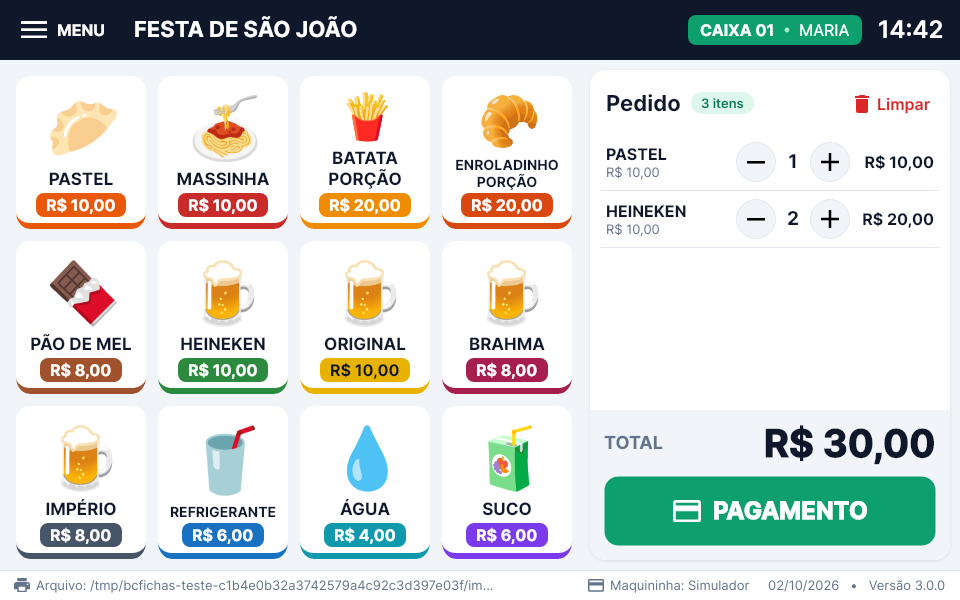
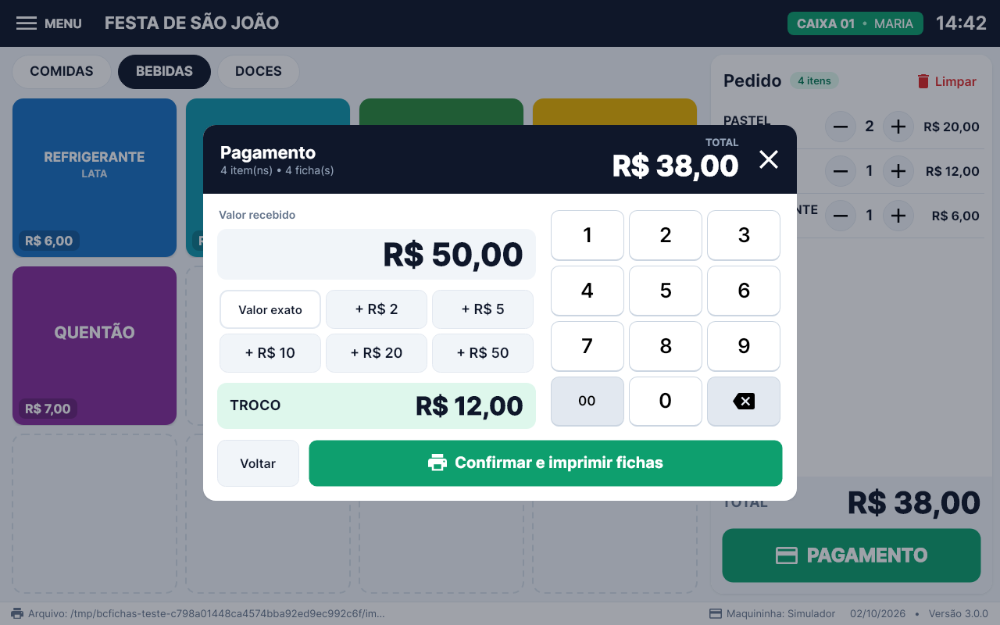
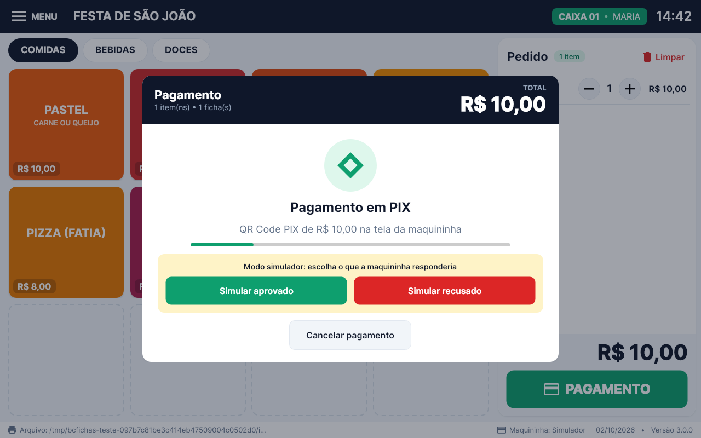
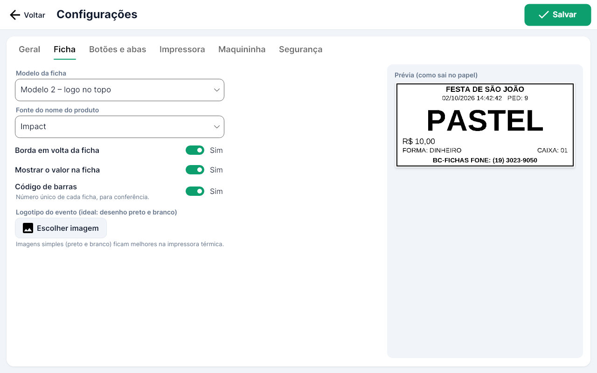
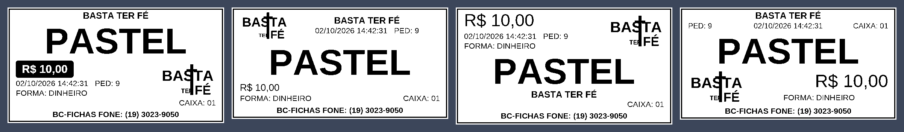
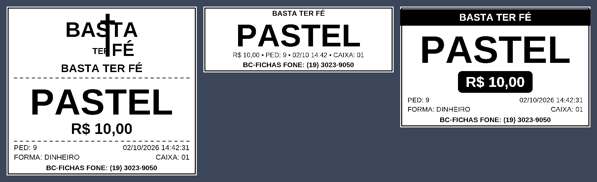

# BC Fichas

Sistema de emissão de fichas para festas, quermesses e eventos. O operador monta o pedido no balcão tocando nos
produtos, escolhe a forma de pagamento (dinheiro, débito, crédito ou PIX) e as fichas saem na impressora térmica,
uma por item, com corte parcial da guilhotina entre uma e outra.

Feito para rodar leve num **tablet Windows 10 de 32 bits com 1 GB de RAM** (Haier W895A, Atom Z3735G) e imprimir
na **Elgin i9** em papel de 80 mm.



## O que tem

| Tela | O que faz |
| --- | --- |
| **Venda** | Botões com foto do produto (ou só cor); abas opcionais (Comidas, Bebidas…); pedido com + e −; total e botão de pagamento. |
| **Pagamento** | Dinheiro com troco calculado e notas rápidas; débito, crédito e PIX pela maquininha. |
| **Produtos** | Nome, detalhe, preço, custo, aba, posição na tela, cor, imagem, estoque e fichas por unidade (combo). |
| **Reimprimir fichas** | Segunda via do pedido inteiro ou de um item só (sai marcado "REIMPRESSÃO"). |
| **Sangria / Suprimento** | Tira ou põe dinheiro no caixa, com comprovante impresso. |
| **Relatórios** | Caixa atual, caixas anteriores e sangrias: totais por forma de pagamento e produtos vendidos. |
| **Abrir / Fechar caixa** | Operador e troco inicial; no fechamento confere o dinheiro da gaveta (falta/sobra) e imprime o relatório. |
| **Configurações** | Nome do evento, rodapé, modelo da ficha (7 modelos com prévia), borda, fonte, logotipo, código de barras, grade de botões, impressora, corte da guilhotina, senha master por tela. |

Também tem teclado na tela (para tablet sem teclado físico), ajuste de tamanho da tela e modo tela cheia.

| Pagamento em dinheiro | PIX na maquininha | Configuração da ficha |
| --- | --- | --- |
|  |  |  |

### Modelos de ficha (papel de 80 mm)

Modelos 1 a 4: os mesmos do sistema antigo, redesenhados.



Modelos 5 a 7: novos.



Depois de cada ficha a guilhotina faz **corte parcial** (a ficha fica presa por um ponto e o operador destaca).
Em Configurações → Impressora dá para trocar para corte total ou sem corte.

Mais telas em [`docs/telas`](docs/telas).

## Maquininha de cartão

Por enquanto a maquininha é **simulada**: no pagamento com cartão ou PIX aparecem os botões "Simular aprovado" e
"Simular recusado". O pedido fica gravado como "aguardando pagamento" antes de ir para a maquininha, então se o
programa fechar no meio do pagamento nada se perde.

A ligação de verdade (tablet → Bluetooth → app ponte na maquininha Smart → pagamento) é a próxima etapa. O programa
já conversa com a maquininha por uma interface única (`IMaquininha`), então essa etapa não mexe nas telas.

## Instalar no tablet

1. Baixe o pacote `BCFichas-win-x86` (tablets de 1–2 GB normalmente usam Windows 32 bits; se o seu for 64 bits,
   use `BCFichas-win-x64`). O pacote é gerado automaticamente pelo GitHub em **Actions → Build → Artifacts**.
2. Descompacte numa pasta, por exemplo `C:\BCFichas`, e abra o `BCFichas.exe`. Não precisa instalar o .NET.
3. Para abrir sozinho ao ligar o tablet: crie um atalho do `BCFichas.exe` na pasta `shell:startup`.

Na primeira vez o sistema já vem com os produtos do cardápio padrão (pastel, massinha, porções, cervejas…),
sem fotos. Para pôr a foto de um produto: **Menu → Produtos → escolha o produto → Imagem**.

### Tablet com Windows 10 antigo (versão 1511)

O programa usa o .NET 10, que oficialmente pede Windows 10 1607 ou mais novo, mas também roda no Windows Server
2012 — então deve rodar no 1511, que é mais novo que ele. Se não abrir, atualize o Windows ou veja o arquivo
`dados\erros.log`. Dicas para 1 GB de RAM: deixe só o BC Fichas aberto e desligue programas que iniciam com o
Windows.

### Impressora Elgin i9

1. Instale o driver da Elgin i9 no Windows (site da Elgin).
2. No BC Fichas: **Menu → Configurações → Impressora**, escolha "Impressora instalada no Windows", selecione a i9
   e toque em **Imprimir teste**.
3. Se a i9 aparecer só como porta COM no Gerenciador de Dispositivos, escolha "Porta COM" e a porta certa.

As fichas são desenhadas como imagem e mandadas em ESC/POS, então a fonte, os acentos, o logotipo e o código de
barras saem iguais à prévia da tela.

### Backup

Tudo fica na pasta `dados` ao lado do programa (`bcfichas.db` e as imagens). Para fazer backup, copie essa pasta.
Erros ficam registrados em `dados\erros.log`.

## Para quem for mexer no código

- **.NET 10** + **Avalonia 11** (interface), **SQLite** (banco), **SkiaSharp** (desenho das fichas).
- `src/BCFichas.Core` — regras de negócio, banco, impressão e maquininha (sem nada de tela).
- `src/BCFichas.App` — telas (Views em XAML e ViewModels).
- `tests/BCFichas.Tests` — testes das regras e das telas (as telas rodam "sem monitor" e geram fotos em
  `tests/BCFichas.Tests/saida`).

```bash
dotnet test                                                   # testes + fotos das telas
dotnet run --project src/BCFichas.App                         # abre o programa
dotnet publish src/BCFichas.App -c Release -r win-x86 -o publish/win-x86   # pacote do tablet
```
