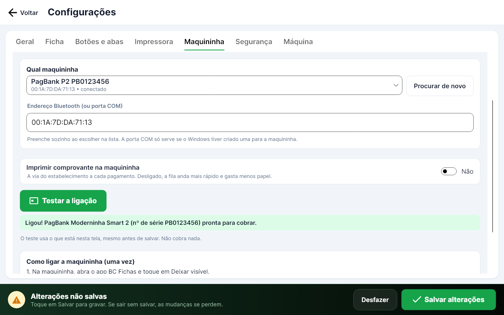
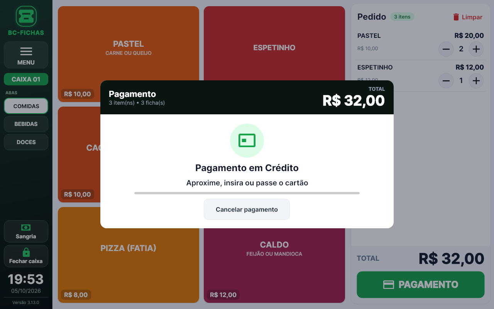
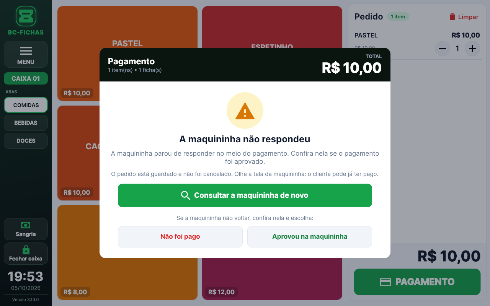

# BC Fichas Cartão

O mesmo BC Fichas (versão 3.11.4) com a **maquininha de cartão ligada ao caixa**: a **Moderninha Smart 2 do
PagBank**, por **Bluetooth**. O operador toca em Débito, Crédito ou PIX e o valor vai sozinho para a maquininha. O
cliente paga nela (cartão ou QR Code do PIX na tela dela) e, quando ela aprova, as fichas saem na impressora do caixa.
Ninguém digita valor na maquininha e ninguém toca em "aprovado".

- **Projeto separado.** Fica na pasta `cartao/` e gera o `BCFichasCartao.exe`, com pasta de dados própria. O BC Fichas
  original e o Rede continuam iguais, e o backup da programação (`.bcf`) serve nos três.
- **Duas partes:** o programa do tablet (Windows) e um app pequeno que vai **dentro da maquininha** (o "app ponte",
  pasta `cartao/ponte-android`). Só a maquininha usa internet (o chip ou o Wi-Fi dela, como hoje).
- **As outras opções continuam:** maquininha separada (só registra a forma de pagamento) e simulador.

| Configurar (aba Maquininha) | Esperando o cliente pagar | A maquininha parou de responder |
| --- | --- | --- |
|  |  |  |

## Como funciona

```
Tablet Windows (BC Fichas Cartão)              Moderninha Smart 2 (app BC Fichas)
┌──────────────────────────┐   Bluetooth   ┌──────────────────────────────┐
│ operador toca em Crédito │ ────────────▶ │ recebe o valor e o pedido    │
│                          │  valor+pedido │ chama o pagamento do PagBank │── internet ──▶ PagBank
│ imprime as fichas        │ ◀──────────── │ (cartão, senha, QR do PIX)   │
└──────────┬───────────────┘   aprovado    └──────────────────────────────┘
           │ USB
       Elgin i9
```

1. O operador fecha o pedido e toca em **Débito**, **Crédito** ou **PIX**.
2. O tablet manda por Bluetooth o valor e o número do pedido.
3. A maquininha abre a tela de pagamento do próprio PagBank: o cliente aproxima, insere ou passa o cartão (ou lê o QR
   Code do PIX na tela dela).
4. A resposta volta sozinha e as fichas saem. No tablet, enquanto isso, aparece o que está acontecendo ("Aproxime,
   insira ou passe o cartão", "O cliente está digitando a senha", "Autorizando...").

No PagBank, cada venda aparece com o código `C01P000123` (caixa 01, pedido 123). O BC Fichas guarda junto do pedido a
bandeira, a autorização, o NSU e o código da transação do PagBank.

## As regras do dinheiro

- **Nunca cobra duas vezes.** Cada pedido tem um identificador fixo e o app da maquininha guarda o resultado de cada um.
  Se o mesmo pedido chegar de novo, ela devolve o resultado guardado, sem cobrar.
- **Uma cobrança por vez.** Se a maquininha ainda está cobrando outro pedido, o tablet avisa "A maquininha está fazendo
  outro pagamento" e não cobra.
- **Cancelar no tablet só pede para a maquininha cancelar.** Se o cliente já tinha pago, vale o pagamento e as fichas
  saem.
- **A ligação caiu no meio?** O tablet liga de novo sozinho (por até 1 minuto e meio) e pergunta pelo mesmo pedido. O
  cliente pode continuar pagando na maquininha nesse tempo.
- **A maquininha sumiu de vez?** O pedido **não é cancelado sozinho**: aparece "A maquininha não respondeu", com
  **Consultar a maquininha de novo** e, se ela não voltar, o operador confere na tela dela e escolhe **Não foi pago**
  ou **Aprovou na maquininha** (os dois pedem confirmação).
- **O programa do tablet fechou no meio de um pagamento?** Ao abrir, ele pergunta à maquininha. Se ela não responder,
  pergunta ao operador, pedido por pedido.
- **O app da maquininha fechou no meio?** Ao abrir, ele confere no PagBank se a última venda aprovada era aquela.
- **A cobrança nem chegou na maquininha** (Bluetooth desligado, maquininha longe ou desligada): o tablet avisa em
  alguns segundos e o pedido é cancelado. Nada foi cobrado.

## O que precisa (uma vez)

### 1. Liberar o app na maquininha (PagBank)

O PagBank só deixa instalar um app de fora nas maquininhas Smart depois de três etapas:

1. **Parceria:** pedido pelo formulário de parceria comercial do PagBank
   ([integração SmartPOS](https://developer.pagbank.com.br/docs/integracao-smartpos-1)). Eles enviam um **terminal de
   desenvolvimento** (a maquininha de teste, onde dá para instalar o app pelo cabo, com o `adb`).
2. **Homologação:** com tudo testado no terminal de desenvolvimento, manda-se o APK de produção (assinado com a chave
   da empresa, nas versões V1 e V2 da assinatura), um vídeo mostrando os pagamentos e o manual. O prazo deles é de 7
   dias úteis por rodada ([homologação](https://developer.pagbank.com.br/devpagbank/docs/homologacao-smartpos)).
3. **Produção:** o app vai para a loja de apps do PagBank e só aparece nas maquininhas ligadas à conta da BC Fichas
   (pelo número de série, pedido a eles). Nas maquininhas de produção não se instala pelo cabo
   ([produção SmartPOS](https://developer.pagbank.com.br/docs/producao-smartpos)).

O PagBank pede que se informe e se justifique qualquer serviço externo do app; aqui, a ligação Bluetooth com o
programa do caixa.

### 2. Parear a maquininha com o tablet

1. Na maquininha, abra o app **BC Fichas** e toque em **Deixar visível para o tablet**.
2. No tablet: **Configurações do Windows → Dispositivos → Bluetooth → Adicionar → Bluetooth**. Escolha a maquininha e
   confirme o mesmo código nos dois.
3. No BC Fichas Cartão: **Configurações → Maquininha → Moderninha Smart 2**, toque em **Procurar de novo**, escolha a
   maquininha na lista, **Testar a ligação** e **Salvar**.

O teste mostra o modelo e o número de série da maquininha e se ela está ativada no PagBank ("pronta para cobrar").
Não cobra nada.

**Imprimir comprovante na maquininha** (desligado de fábrica): a via do estabelecimento a cada pagamento. Desligado, a
fila anda mais rápido e gasta menos papel.

### 3. Instalar no tablet

1. No GitHub, em **Actions → Build Cartão**, baixe o **BCFichasCartao-win-x86** (tablet de 32 bits) ou o
   **BCFichasCartao-win-x64**.
2. Descompacte numa pasta **só dele**, por exemplo `C:\BCFichasCartao` (não na pasta do BC Fichas original nem na do
   Rede).
3. Abra o **BCFichasCartao.exe**. Os dados ficam na pasta `dados` ao lado dele.

O app da maquininha sai no mesmo lugar: **BCFichasPonte-apk-teste** (para o terminal de desenvolvimento) e
**BCFichasPonte-apk-release-sem-assinatura** (para assinar com a chave da empresa e mandar para a homologação).

## No dia a dia

- Deixe o app **BC Fichas aberto na maquininha** (pode ficar em segundo plano: ele aparece na barra de avisos). Ao
  ligar a maquininha, ele já começa a esperar o tablet sozinho.
- A maquininha precisa estar **perto do tablet** (alguns metros) e com **internet** (chip ou Wi-Fi dela).
- **Estorno:** é feito no PagBank (app ou site), como hoje, com o código da transação que fica guardado no pedido. O
  PIX não tem estorno pela maquininha: é pelo internet banking do PagBank.

## Problemas comuns

| O que acontece | O que fazer |
| --- | --- |
| "Não consegui ligar na maquininha por Bluetooth" | Confira se a maquininha está ligada, perto do tablet e com o app BC Fichas aberto, e se o Bluetooth dos dois está ligado. Nada foi cobrado. |
| A maquininha não aparece na lista | Pareie de novo no Bluetooth do Windows (passo 2) e toque em **Procurar de novo**. |
| "A maquininha não está ativada no PagBank" | Abra o app do PagBank na maquininha e faça a ativação com a conta da BC Fichas. |
| "A maquininha está fazendo outro pagamento" | Termine (ou cancele) o pagamento que está na tela da maquininha e cobre de novo. |
| "A maquininha não respondeu" | Toque em **Consultar a maquininha de novo**. Se ela não voltar, confira na tela dela e escolha **Não foi pago** ou **Aprovou na maquininha**. |
| O Bluetooth direto não funciona num tablet | Alternativa: no Windows, crie uma porta COM de saída para a maquininha ("Mais opções de Bluetooth → Portas COM → Adicionar → Saída") e digite a porta (ex.: `COM7`) no campo **Endereço Bluetooth (ou porta COM)**. |

## O que falta (precisa da maquininha de verdade)

Tudo o que dá para testar sem o terminal está testado: o programa do tablet com uma maquininha de mentira que conversa
igual ao app (aprovado, recusado, cancelado, PIX, ligação que cai no meio, maquininha que some, pedido repetido,
programa que fecha no meio) e o app da maquininha com um PagBank de mentira. Falta conferir no **terminal de
desenvolvimento do PagBank**:

- a ligação Bluetooth de verdade entre o tablet e a Smart 2 (pareamento, alcance, religar);
- as telas do PagBank aparecendo por cima do app e os textos que ele manda durante o pagamento;
- o PIX (no terminal de teste, o PagBank precisa aprovar o PIX do lado deles: é preciso marcar um horário);
- o app voltando sozinho depois de a maquininha reiniciar.

## Para quem desenvolve

```
cartao/
  src/BCFichas.Core      o núcleo do BC Fichas + Pagamento/ (MaquininhaPagBank, ProtocoloPonte, Bluetooth do Windows)
  src/BCFichas.App       o caixa (BCFichasCartao.exe): aba Maquininha e a tela de pagamento
  tests/BCFichas.Tests   os testes do BC Fichas + os da maquininha (PonteFalsa: uma Smart 2 de mentira pela rede)
  ponte-android/         o app da maquininha (Kotlin, PlugPagServiceWrapper 1.35.0 do PagBank)
```

- **Mensagens:** uma linha de JSON por mensagem. Tablet → maquininha: `ola`, `cobrar`, `consultar`, `cancelar`,
  `ping`. Maquininha → tablet: `ola`, `andamento`, `resultado`, `desconhecida`, `ocupada`, `erro`, `pong`. O formato
  está em `src/BCFichas.Core/Pagamento/ProtocoloPonte.cs` e em `ponte-android/.../Protocolo.kt`.
- **Bluetooth:** RFCOMM direto pelo socket do Windows (sem porta COM), no serviço
  `b7c1f00d-5f1c-4d2e-9a3b-2f6c8e4a1b10`. O app também atende na porta serial padrão (SPP), para quem usar porta COM.
  Para testar sem Bluetooth, a ligação pode ser `tcp://endereço:porta`.
- **App da maquininha:** `minSdk` e `targetSdk` 23 (pedido do PagBank), sem bibliotecas de fora além das que o SDK do
  PagBank exige (AndroidX Core e RxJava 2). O núcleo (`Ponte.kt`) não depende do Android e tem testes no computador.

```
dotnet test tests/BCFichas.Tests -c Release
dotnet publish src/BCFichas.App -c Release -r win-x86 -o publish/BCFichasCartao-win-x86

cd ponte-android
./gradlew testDebugUnitTest assembleDebug        # o SDK do PagBank vem do repositório deles no GitHub
./gradlew -PrepositorioPagBank=file:///pasta/do/sdk assembleDebug   # ou de uma cópia local
```

O GitHub Actions (`.github/workflows/cartao.yml`) roda os testes e gera o programa do tablet e o app da maquininha
sempre que algo muda em `cartao/`.
