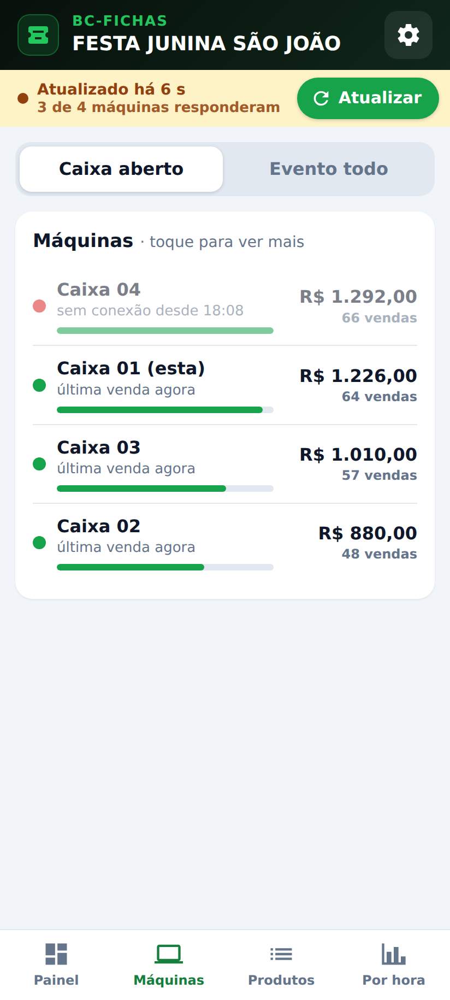
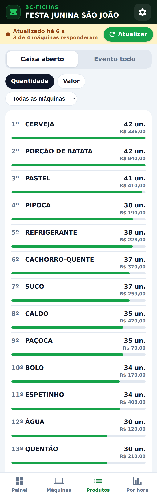
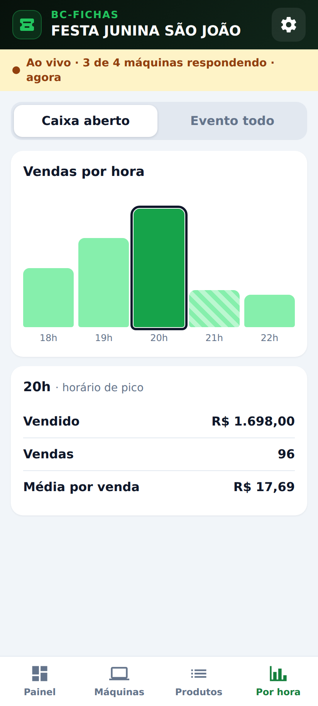
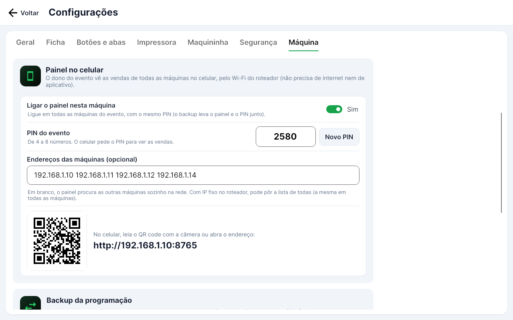
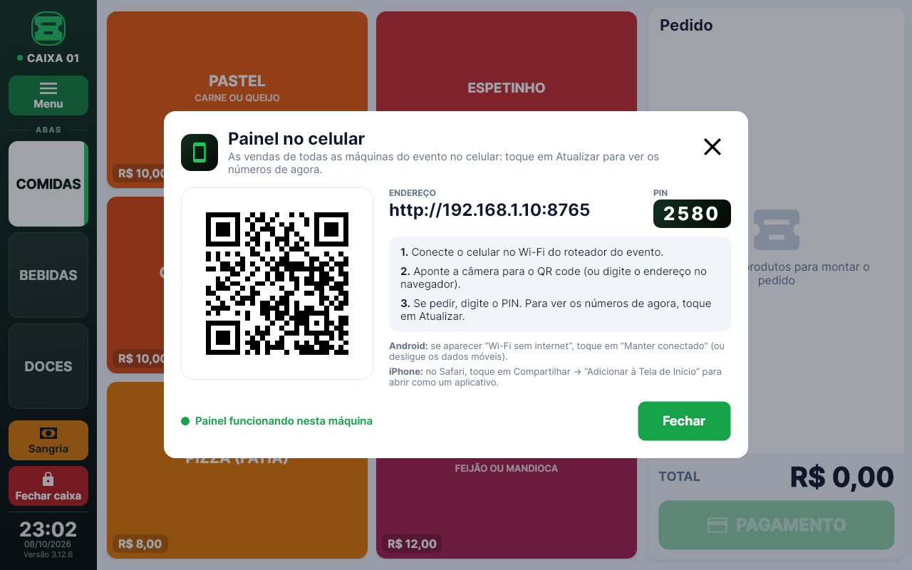

# BC Fichas Rede

O mesmo BC Fichas (versão 3.11.7) com uma novidade: o **painel no celular**. O dono do evento conecta o celular no
Wi-Fi do roteador das máquinas e vê, com um toque em **Atualizar**, as vendas de todas as máquinas juntas: total vendido, formas de
pagamento, cada máquina, os produtos mais vendidos e as vendas por hora.

- **Não precisa de internet.** Tudo acontece dentro da rede do roteador do evento (pode ser oculta).
- **Não precisa instalar aplicativo.** Funciona no navegador do celular, no **Android e no iPhone** (lê o QR code e abre).
- **Só consulta.** O painel não consegue mudar nada no caixa: só lê as vendas.
- **Projeto separado.** Fica na pasta `rede/` e gera o `BCFichasRede.exe`. O BC Fichas original continua igual,
  sem nenhuma mudança: pode instalar os dois no mesmo tablet que um não mexe no outro.

Apresentação para avaliação (PDF, 10 páginas): [docs/painel-no-celular.pdf](docs/painel-no-celular.pdf).

| No celular: painel | Cada máquina | Produtos | Vendas por hora |
| --- | --- | --- | --- |
|  |  |  |  |

| No caixa: ligar o painel (Configurações → Máquina) | No caixa: Menu → Painel no celular |
| --- | --- |
|  |  |

## Como funciona

Junto com o caixa vem um segundo programa, o **BCFichasPainel.exe**, que roda escondido (sem janela), com
prioridade baixa (a venda sempre vem primeiro). O caixa abre o painel sozinho quando ele está ligado nas
configurações, e o painel fecha sozinho quando o caixa fecha.

```
  Celular do dono ──Wi-Fi──► Roteador do evento (sem internet)
                                 │
          ┌──────────────┬───────┴──────┬──────────────┐
     192.168.1.10   192.168.1.11   192.168.1.12   192.168.1.14
      Caixa 01       Caixa 02       Caixa 03       Caixa 04
```

- O celular abre o endereço de **qualquer** máquina (ex.: `http://192.168.1.10:8765`). Essa máquina pergunta às
  outras como estão as vendas e mostra tudo somado. Se ela for desligada, é só abrir o endereço de outra.
- **Atualiza quando o dono pede:** ao abrir o painel os números já vêm atualizados; depois, é tocar em **Atualizar**
  (fica em cima, sempre à vista, com "Atualizado há…"). Só nessa hora as máquinas conversam: no resto do tempo ficam
  quietas (não pesa no tablet nem no Wi-Fi). Voltando ao painel depois de mais de 1 minuto (outro aplicativo, tela
  apagada), ele atualiza sozinho uma vez.
- Máquina desligada ou fora da rede: continua no painel com os últimos números, em cinza, com "sem conexão desde…",
  e o total avisa "Parcial: 3 de 4 máquinas responderam". O Atualizar espera cada máquina no máximo 2 segundos.
- Só entram as máquinas com o **mesmo PIN**: duas festas no mesmo roteador não se misturam.
- As vendas do **modo teste** ficam de fora (como nos relatórios do cliente).

## Instalar para testar

1. No GitHub, em **Actions → Build Rede**, baixe o **BCFichasRede-win-x86** (tablet de 32 bits) ou
   **BCFichasRede-win-x64**.
2. Descompacte numa pasta **só dele**, por exemplo `C:\BCFichasRede` (não na pasta do BC Fichas original).
3. Abra o **BCFichasRede.exe**. Os dados ficam na pasta `dados` ao lado dele, separados do original. O backup
   da programação (`.bcf`) é o mesmo formato: dá para restaurar uma programação do BC Fichas original aqui e vice-versa.

> O `BCFichasPainel.exe` tem que ficar na mesma pasta do `BCFichasRede.exe` (o pacote já vem assim).

4. Num tablet novo, o programa pede a **senha técnica** uma vez ("Este tablet não está liberado"), como o original.
   O painel no celular só liga depois que o tablet está liberado.

## Preparar o roteador (uma vez)

| O quê | Como |
| --- | --- |
| **IP fixo para cada máquina** | No roteador, em "Reserva de DHCP" / "Endereço reservado", dê um IP para cada tablet: 192.168.1.10, .11, .12, .14… Assim o endereço do painel nunca muda. |
| **Desligar o isolamento** | Procure "Isolamento de AP", "Isolamento de clientes" ou "Rede de convidados" e deixe **desligado**. Ligado, os aparelhos não se enxergam e o painel não funciona. |
| **Wi-Fi de 2,4 GHz** | Os tablets e a maioria dos celulares se dão melhor no 2,4 GHz. Se o roteador tiver os dois, use o mesmo nome só no 2,4 GHz ou ponha os tablets nele. |
| **Rede oculta e sem internet** | Pode. No celular, adicione a rede à mão (nome e senha). |

## Ligar o painel nas máquinas

1. **Configurações → Máquina** (senha técnica) → bloco **Painel no celular** → **Ligar o painel nesta máquina**.
   Já vem um PIN de 6 números (pode trocar: de 4 a 8 números).
2. **Endereços das máquinas** (opcional): com IP fixo, ponha a lista de todas, por exemplo
   `192.168.1.10 192.168.1.11 192.168.1.12 192.168.1.14` (a mesma lista em todas; pode incluir a própria). Em
   branco, o painel procura as outras máquinas sozinho na rede (a primeira vez que alguém abre o painel leva uns
   segundos a mais).
3. **Liberar no firewall**: toque uma vez em cada máquina. O Windows pede permissão de administrador; a regra só
   aceita aparelhos da rede local. Sem isso, o Windows bloqueia o celular.
4. **Salvar.**
5. Nas outras máquinas, o jeito mais fácil é **fazer o backup** na primeira e **restaurar** nas outras: o painel, o
   PIN e a lista vão junto (só muda o número do caixa). "Zerar programação" (novo evento) mantém o painel ligado e
   o mesmo PIN, porque eles são do kit (roteador e máquinas), não do evento.
6. **Tablets clonados** (a mesma imagem do disco em vários tablets) também funcionam: cada um aparece no painel como
   uma máquina (o painel reconhece a placa de rede de cada tablet). Só troque o **número do caixa** em cada um.

## No celular

No caixa, **Menu → Painel no celular** mostra o QR code, o endereço e o PIN (pede a mesma senha dos Relatórios,
se ela estiver travada).

1. Conecte o celular no Wi-Fi do roteador do evento.
2. Aponte a câmera para o QR code (ou digite o endereço no navegador). O QR code já leva o PIN.
3. Pronto. O celular guarda o PIN: da próxima vez é só abrir.

- **Android:** quando avisar que a rede não tem acesso à internet, responda que quer continuar conectado (o nome
  do botão muda conforme a marca: "Sim", "Manter conectado"...). Se o painel não abrir,
  **desligue os dados móveis** (com eles ligados, alguns Android mandam tudo pelo 4G, onde as máquinas não estão).
- **iPhone:** abra no **Safari** e toque em Compartilhar → **Adicionar à Tela de Início**: fica um ícone do
  BC Fichas que abre como um aplicativo.

### O que aparece

| Aba | O que mostra |
| --- | --- |
| **Painel** | Total vendido (grande), número de vendas e fichas, devoluções, média por venda, dinheiro estimado nos caixas, sangrias, formas de pagamento com barra colorida, as máquinas e os 3 produtos mais vendidos. |
| **Máquinas** | Cada caixa com o total, a última venda e se respondeu. Toque para ver as formas de pagamento e o dinheiro daquela máquina. |
| **Produtos** | Ranking por quantidade ou por valor, de todas as máquinas ou de uma só. |
| **Por hora** | Barras com as vendas de cada hora, o horário de pico em destaque. Toque numa barra para ver os números. |

Em cima dá para escolher **Caixa aberto** (só o caixa que está aberto agora em cada máquina) ou **Evento todo**
(todos os caixas guardados, inclusive os já fechados).

## Segurança

- O painel abre o banco do caixa **só para leitura**: não consegue gravar nada, nem por engano.
- Sem o PIN não aparece nenhum número. Errou o PIN 5 vezes: aquele celular fica bloqueado por 5 minutos.
- Só responde para aparelhos da rede local (192.168.x, 10.x, 172.16-31.x); a regra do firewall também.
- O PIN não é a senha master nem a senha técnica: serve só para ver as vendas.

## Peso no tablet

O painel roda separado do caixa, com prioridade baixa. Medido num computador de 64 bits, usa uns 75 MB de memória
parado e 85 MB servindo o celular (no tablet de 32 bits tende a ser um pouco menos), e quase nada do processador. Quando alguém toca em Atualizar, cada máquina soma as vendas dela só se mudou alguma coisa (uma
leitura com 3.000 vendas leva poucos milésimos num computador comum). O pacote fica uns 27 MB maior que o do
BC Fichas original.

## Problemas comuns

| O que acontece | O que fazer |
| --- | --- |
| O celular não abre o endereço | Confira se o celular está no Wi-Fi do roteador; no Android, desligue os dados móveis; toque em **Liberar no firewall** na máquina; confira se o isolamento de AP do roteador está desligado. |
| "3 de 4 máquinas responderam" | A máquina que falta está desligada, fora do Wi-Fi, com o painel desligado ou com outro PIN. |
| Uma máquina não aparece | Com a lista de endereços em branco, as máquinas são procuradas no máximo uma vez por minuto: espere um minuto e toque em Atualizar, ou ponha os endereços na lista. |
| "Muitas tentativas erradas" | Errou o PIN 5 vezes: espere 5 minutos. |
| Menu → Painel no celular diz "não respondeu" | Feche e abra o programa. Se continuar, veja o arquivo `dados\painel-erros.log` e chame o suporte. |

## Aplicativo de verdade (próxima fase)

Hoje o painel funciona pelo navegador, sem instalar nada, no Android e no iPhone. Um aplicativo próprio seria:

- **Android:** dá para fazer um aplicativo que se conecta sozinho no Wi-Fi do evento e ignora o 4G (resolve o
  "desligue os dados móveis"). Para testar, a conta gratuita do Google instala em até 20 aparelhos. Para distribuir
  a todos, o Google passa a exigir em 2027 o cadastro do desenvolvedor (US$ 25, uma vez, com documento) também para
  aplicativos instalados fora das lojas (desde 30/09/2026 isso já vale no Brasil para os instalados pelas lojas).
- **iPhone:** a Apple exige a conta de desenvolvedor (US$ 99 por ano) e um Mac (ou um serviço de compilação). Para
  o iPhone, o painel pelo Safari com "Adicionar à Tela de Início" já faz o mesmo papel.

## Para quem desenvolve

```
rede/
  src/BCFichas.Core     o mesmo núcleo do BC Fichas (+ campos do painel na configuração e banco só leitura)
  src/BCFichas.App      o caixa (BCFichasRede.exe): abre o painel, aba Máquina e item do Menu
  src/BCFichas.Painel   o painel (BCFichasPainel.exe): servidor web leve (ASP.NET Core) + a página do celular
  tests/BCFichas.Tests  os testes do BC Fichas + os do painel (servidor, várias máquinas, programa, fotos do celular)
```

- Página do celular: `src/BCFichas.Painel/Pagina/index.html` (HTML, CSS e JavaScript num arquivo só, dentro do
  programa; nada vem da internet).
- Endereços: `GET /api/v1/info` (sem PIN: quem é a máquina), `GET /api/v1/estado` (as vendas desta máquina) e
  `GET /api/v1/evento` (todas as máquinas juntas: pergunta às outras na hora). PIN no cabeçalho `X-Pin`; respostas com `ETag` (nada mudou:
  `304`, sem corpo).
- Porta `8765`. Linha de comando do painel: `BCFichasPainel.exe --dados <pasta> [--porta 8765] [--pai <pid do caixa>]`.

```
dotnet test tests/BCFichas.Tests -c Release
dotnet publish src/BCFichas.App    -c Release -r win-x86 -o publish/BCFichasRede-win-x86
dotnet publish src/BCFichas.Painel -c Release -r win-x86 -o publish/BCFichasRede-win-x86
```

O GitHub Actions (`.github/workflows/rede.yml`) roda os testes e gera os pacotes sempre que algo muda em `rede/`.
O build do BC Fichas original (`build.yml`) continua o mesmo.
